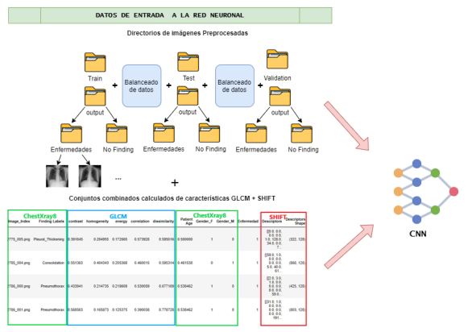
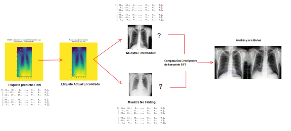
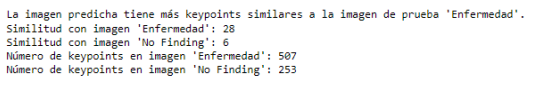
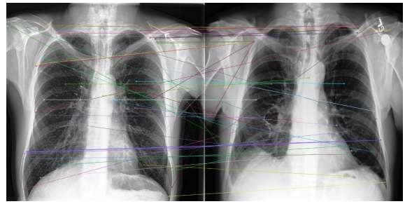

# 

## Contributor: Miguel Ramos López

---
### Abstract
Health remains the paramount factor impacting people's quality of life, especially amid current challenges. The imperative to enhance healthcare continually underscores the need for accessible and innovative medical solutions. 
While Artificial Intelligence (AI) and healthcare have collaborated for years, Machine Learning (ML) algorithms, despite yielding optimal outcomes, often lack transparency, limiting their utility for medical experts in result interpretation. This is where Explainable Artificial Intelligence (XAI) emerges, offering superior performance coupled with transparent result elucidation, striking a balance between accurate predictions and comprehensible information for specialists.
Hence, the proposed solution focuses on amalgamating high-performing ML algorithms with XAI techniques to deliver precise predictions bolstered by explicit explanations. This fusion creates a robust AI, empowering specialists with valuable support and strengthening their trustworthiness.

---
### AI Workflow

### CNN Data used

### Interpretability Approach

---
### Results
Understanding the inner workings of an interpretable model is crucial before implementing eXplainable Artificial Intelligence (XAI) techniques. Despite the use of Convolutional Neural Networks (CNN) for predictions, these models lack transparency in decision-making processes.

To address this, our study categorizes XAI methods based on scope, stage, problem type, and input data. By doing so, we aim to choose the most effective interpretability techniques tailored to our specific application and classifier nature.

It's important to note that while CNN usage limits interpretability, our approach involves a mix of techniques to achieve visually interpretable explanations.

